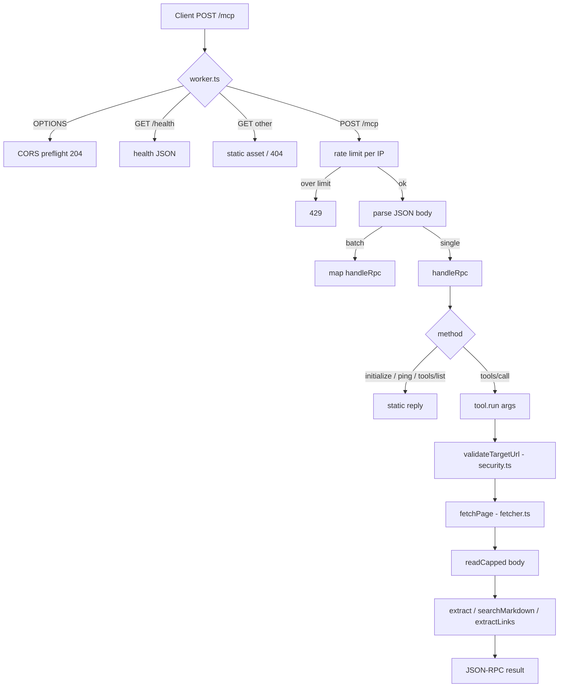

# Architecture

`mcp.vanshul.com` is a single [Cloudflare Worker](https://developers.cloudflare.com/workers/)
that exposes a [Model Context Protocol](https://modelcontextprotocol.io) (MCP) server over
the **Streamable HTTP** transport. It turns any public web page into clean Markdown (plus
metadata, links and query-focused snippets) so AI agents can read the live web.

There is no database, no queue and no LLM in the request path — extraction is deterministic.

## Request lifecycle



## Modules (`src/`)

| File | Responsibility |
| --- | --- |
| `worker.ts` | HTTP entry point. Routes `/mcp`, `/health` and static assets; CORS; per-isolate rate limit; JSON-RPC batch handling. |
| `mcp.ts` | JSON-RPC 2.0 dispatch (`initialize`, `ping`, `tools/list`, `tools/call`) and the four tool definitions. |
| `extract.ts` | HTML → Markdown / links via linkedom + Mozilla Readability + Turndown. |
| `search.ts` | `searchMarkdown` — query-focused, relevance-ranked passage search over extracted Markdown. |
| `fetcher.ts` | Bounded `fetch`: timeout, size cap, manual redirect following with per-hop re-validation. |
| `security.ts` | SSRF guard: `validateTargetUrl` + `isPrivateIpLiteral`. |

## Extraction pipeline

```
raw HTML → linkedom (parse) → Mozilla Readability (main article)
         → Turndown (Markdown)      ← the same engine as Firefox Reader Mode
```

A `<base href>` is injected before parsing so relative links resolve to absolute URLs.
Turndown is fed a **detached DOM node** (not an HTML string) because the Workers runtime
has no global `document`/`DOMParser` — see the comment in `extract.ts`.

## Limits & defaults

| Concern | Value | Where |
| --- | --- | --- |
| Rate limit | 60 requests / minute / IP | `worker.ts` |
| Fetch timeout | 10 s | `fetcher.ts` |
| Page size cap | ~3 MB | `fetcher.ts` (`MAX_BYTES`) |
| Max redirects | 5 (each re-validated) | `fetcher.ts` |
| Protocol version | `2025-06-18` | `mcp.ts` |

The rate limiter is per-isolate and in-memory — fine for a personal tool, but a production
deployment would use Cloudflare rate-limiting or a Durable Object for a shared counter.

## Why a Worker

- Runs at the edge with no server to manage and a generous free tier.
- The extraction dependencies (linkedom, Readability, Turndown) run in the Workers runtime
  with `nodejs_compat`.
- Static landing page is served by the Worker's `[assets]` binding for any non-API path.
